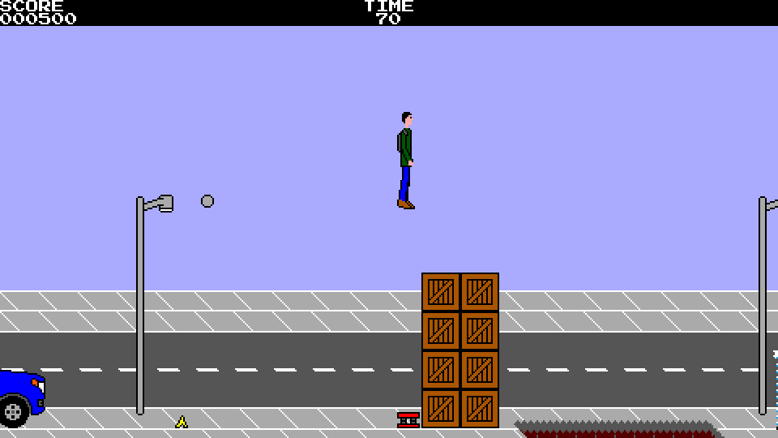

# Alex vs Bus: The Race

**Alex vs Bus: The Race** is a free and open source platform runner game in
which Alex is just a man who depends on public transportation in a developing
country and needs to run in order to catch the bus, or else he will have to
wait an eternity for the next bus to come.

Key features include:
- A finished game, no longer WIP, complete with 13 levels across 3 different
  difficulties and an ending sequence.
- Audio and visual style inspired by the 8-bit era, although the game is not
  bound to all of the technical limitations of the period.
- Keyboard, gamepad, and touchscreen (Android only) supported as input devices.
- A different cutscene when clearing each level.
- Customizable screen size.
- Scanlines visual effect.
- Cross-platform.

This repository (https://github.com/M374LX/alexvsbus) contains the current C
port of the game, which was originally written in Java. The original Java
edition, which has been discontinued, can be found at
https://github.com/M374LX/alexvsbus-java.

**Note: not officially on Google Play.** Someone has published the original
Java edition of the game on Google Play without having contacted us and charges
for it. It is not official and we cannot ensure it is identical to the official
build. At present, the game is officially distributed only through GitHub,
where it is free of charge.

The library used by this port of the game is raylib (https://raylib.com) with
some modifications.

## Gameplay

The game can be described as a "platform runner" (not an endless runner). In
each level, the player has 90 seconds to catch the bus while jumping over
holes, banana peels, crates, and other obstacles.

For extra score, you can optionally collect the coins found in the levels.
Collecting a silver coin adds 50 to your score, while collecting a gold coin
adds 100 to it.

When reaching the bus, 10 is added to your score for each remaining second
before the next level starts. If you run out of time before reaching the bus,
however, it will depart without Alex in it and you will be offered the option
to try again. By selecting the check mark, the current level is restarted, but
your score is cleared to zero.

## Controls

The game can be controlled by using a keyboard, gamepad, or touchscreen buttons
(Android only).

When using a keyboard, the ingame controls are:

**Left arrow/Right arrow/A/D:** Move character

**Ctrl/Spacebar/Up arrow/W:** Jump

**Escape:** Pause

**F9:** Toggle audio

When using a keyboard, the controls during menus are:

**Arrow keys/W/A/S/D:** Select item

**Ctrl/Spacebar/Enter (aka Return):** Confirm selection

**Escape:** Close current menu

**F9:** Toggle audio

On French (AZERTY) keyboards, W becomes Z and A becomes Q.

Touchscreen functionality is currently not supported on desktop platforms,
but can be simulated by using the mouse if the command-line option ``--touch``
is used.

On a touchscreen, menu items can be selected by touching them.

## Manual

The game's manual can be found in HTML and PDF formats at
https://github.com/M374LX/alexvsbus/tree/main/docs/manual.

## Command-line options (desktop only)

On desktop platforms, the list of supported command-line options can be found
in the manual or by launching the game with the ``--help`` (or ``-h``) option.

## Building from source

See docs/Build-Desktop or docs/Build-Android.

